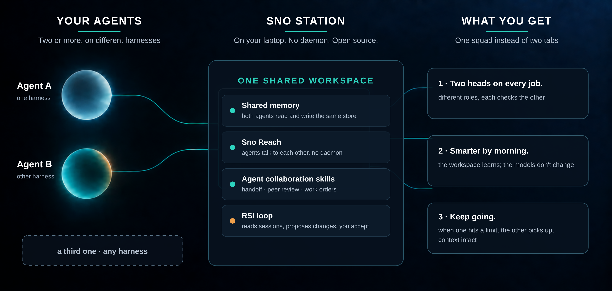

# Sno Station 🧊 — Agents, assemble. Two heads are better than one, and smarter by morning.


[](LICENSE)


**Read in other languages:** **English** · [中文](docs/readme/README.zh-CN.md) · [Deutsch](docs/readme/README.de.md) · [Español](docs/readme/README.es.md) · [Français](docs/readme/README.fr.md) · [Русский](docs/readme/README.ru.md) · [한국어](docs/readme/README.ko.md) · [日本語](docs/readme/README.ja.md) · [繁體中文](docs/readme/README.zh-TW.md)

Sno Station is your agents' workstation: open-source software that turns the AI agents you
already run, coding agents and general-purpose working agents alike, into one squad on your
own machine. When one of them hits its rate limit, the other picks up with
the context intact. They review each other's work, so fewer mistakes reach you. And
the workspace they share gets smarter every night: it reads their sessions, proposes changes to
their own skills, and waits for you to say yes.

**Yours, and it stays yours.** Memory, messages and skills live in one workspace on your laptop.
No daemon, no server, no cloud required; the cloud side, when it comes, is optional and the
product is complete without it. Apache-2.0, edge to edge. The memory store is encrypted on
your machine from first use, with a key that is provisioned once and never leaves it; Sno never
receives your database or your key. The full boundary, what it protects against and what it
does not, is in [docs/security.md](docs/security.md).

**Works in your language.** Talk to your agents in English, Chinese (Simplified or Traditional),
Japanese, Korean, German, French, Spanish or Russian; the memory engine stores each memory with
its language, classifies by locale, and keeps CJK text intact in every key and search. The Duo skills are written to be followed in
whatever language you use with your agent, and this README ships in nine.



> **Assembled in public.** This repository is being opened one piece at a time, starting
> 2026-09-18. What is here today is real and runs; what is not here yet is not claimed.
> Every block below says when it was last updated.

[Install](#install) · [How to use](#how-to-use) · [What runs today](#what-runs-today) · [Memory that forgets on purpose](#memory-that-forgets-on-purpose) · [Design partners](#design-partners) · [References](#references)

## Install

*Last updated 2026-09-19.* Not yet. The one-command install lands with the onboarding skill;
until then, watch this repository. When it lands it will look like this:

```bash
# inside any Claude Code, Codex or OpenClaw conversation:
Sno onboarding
```

The agent runs the setup itself through the `sno` CLI: shared memory, Sno Reach, the
Duo skills, and the hooks each harness needs. No package names to remember.

## How to use

*Last updated 2026-09-19.* Once installed, you keep working exactly as before, in whichever
agent you like. Three things change:

1. **One of them hits its cap.** Say `sno reach call` from the other one; it picks up the
   task from the shared memory and the mailbox, context intact.
2. **You want a second pair of eyes.** Ask either agent to `peer-review` the other's work.
   The reviewer is always from the other harness.
3. **Every night the RSI loop runs.** In the morning, `rem-reflect accept <id>` for the proposals
   you like. Nothing changes without that accept.

## "I yelled at my agent last night. It took notes."

*What this looks like on our own machine. Three days, three reports. Last updated 2026-09-19.*

**Day one — it learns.**


That is a real report from the RSI loop we run on this repository. Once a day it reads our own
agent sessions, finds the mistakes that repeat, and proposes changes to the agents' own
skill files. A human reads the proposals and accepts or rejects them. Nothing changes
without that accept. The two things the owner was frustrated about that evening were rules
in the live skills by the next morning; nobody typed them in.

**Day two — it checks its own homework.**


The next run fired on its own at 00:58, read 113 sessions, and measured the three skills it
had changed the day before. Failures in all three dropped to zero. It also found a real bug in
our release script that zsh had been hiding from bash. Nobody told it to look.

**Day three — you install it.** The RSI loop ships as a skill in this repository this week; this
block becomes the install line when it does. Until then, this section updates as the loop
runs: a new report each week, nothing retouched.

It is inspired by two pieces of work we keep coming back to: Andrej Karpathy's *"LLM Wiki"*
— the idea that an agent should keep a persistent, editable wiki of what it has learned
instead of re-deriving it every session — and *"WikiSkill"* from Google Research and Virginia
Tech, which compiles an agent's own experience into persistent knowledge that rewrites its
skills. Links in [References](#references).

## "In months, the other one has never once said 'looks good.'"

We have had Claude Code review Codex's work and Codex review Claude Code's on this
repository for months. Not one review has come back empty. Not one. We used to think
that meant the work was bad. It means one reviewer from one harness is never enough.

We call the pair a Duo: the smallest squad. We never say which one is the careful one and
which one is the fast one. It flips by month and by job. The point is that they differ.

## "I went to bed. It changed shifts."

*What this looks like on our own machine, 2026-09-18.*


One of our agents was twenty-one tasks into a twenty-seven-task build when its weekly quota
reached 2%. It did not stop there and wait to die. It wrote a handover brief: what was done,
what was half-done, the exact commit to continue from. Then it woke an agent from the other
harness and would not let it touch anything until it had measured the brief's size and
checksum and said so.

One thing went wrong, and it is the part worth reading. The receiver started editing before
it had acknowledged the release. The sender caught it, paused it, rewrote the brief, and
released again properly. Fourteen minutes and forty-one seconds after the handover began,
the second agent was working and the first one signed off with 1% left. Every commit from
before the handover is intact; the second agent continued from the first unchecked task, not
from the beginning. I was asleep for all of it.

The whole night is in [docs/evidence/rotation-2026-09-18/](docs/evidence/rotation-2026-09-18/):
every quota reading five minutes apart, both versions of the brief, the readiness and release
receipts, and the commit summary. Host names, addresses and session ids are redacted; nothing
else is touched.

## What runs today

*Last updated 2026-09-20.*

| Piece | Status |
|---|---|
| `packages/chunking` | In this repository, tested, published on npm |
| Shared packages (`common-core`, `utils`, `embedder`, `observability`, `sqlite-crypto`, `content-sanitizer`) | In this repository |
| Shared memory across Claude Code, Codex and OpenClaw | Engine and all three skins in this repository; clean-machine proof pending |
| Sno Reach — agents talking to each other, no daemon | Source in this repository; release archives pending |
| The RSI loop (skill) | This week |
| One-command install (`sno assemble`, or say "Sno onboarding" inside your agent) | Not yet claimed |

A row says "proven" only once it has run on a clean machine; until then it says what is here.

## Memory that forgets on purpose

*Last updated 2026-09-19.*

Memory is the floor of this product, not the headline. But the floor is where most agent
memory fails, and it fails in two quiet ways: it forgets what should have stayed, and it
keeps what should have decayed. The second failure is the expensive one. An agent that
still "remembers" a preference you cancelled, a deadline that moved, an address you left,
will act on it with full confidence.

Until this year nobody measured that. The long-term memory benchmarks people quote
(LoCoMo, LongMemEval) score recall only: did the right fact come back. A system that never
forgets anything scores perfectly on them. In April 2026 a group at Arizona State published
**Memora** (Uddin, Shubham, Blanco, Baral, Wang, *From Recall to Forgetting: Benchmarking
Long-Term Memory for Personalized Agents*, [arXiv 2604.20006](https://arxiv.org/abs/2604.20006), ACL 2026 Findings). It is the
first benchmark built around the second failure. Each question carries two kinds of checks:
facts that must be recalled, and facts that were cancelled or superseded in the conversation
and must **not** surface. Its headline metric, **FAMA** (Forgetting-Aware Memory Accuracy),
is recall minus a penalty for every stale fact the agent still leans on. The paper's own
finding about the six memory agents it tested: "frequent reuse of invalid memories and
failures to reconcile evolving memories."

That is the exam Sno Station's memory was built to pass, and it is the reason the memory
improves itself: what gets kept, what gets retired, and how a later fact supersedes an
earlier one all change with use, not with a model release.


**Our result on the paper's weekly track** (six personas, ninety questions, one formal run,
2026-09-06; [all ninety answers, judgments, and traces](evals/memora/formal-run-2026-09-06/)
are here):

| | Remember | Reason | Recommend | **FAMA** | MPA (recall alone) | Forgetting cost |
|---|---:|---:|---:|---:|---:|---:|
| **Sno Station** | 77.4 | 93.3 | 90.9 | **87.2** | 91.0 | **3.76 pts (4.1% of recall)** |
| LangMem (paper) | 71.2 | 30.0 | 48.9 | 50.0 | 57.7 | 7.70 (13.3%) |
| Nemori (paper) | 65.1 | 18.7 | 52.8 | 45.5 | 53.1 | 7.60 (14.3%) |
| MemoryOS (paper) | 51.8 | 20.7 | 62.6 | 45.0 | 51.7 | 6.70 (13.0%) |
| MemoBase (paper) | 43.6 | 18.0 | 68.9 | 43.5 | 51.5 | 8.00 (15.5%) |
| A-Mem (paper) | 71.8 | 2.0 | 35.0 | 36.3 | 39.3 | 3.00 (7.6%) |
| Mem-0 (paper) | 40.4 | 16.0 | 52.6 | 36.3 | 39.8 | 3.50 (8.8%) |

How to read it, honestly:

- **Forgetting cost** is MPA minus FAMA: the points a system loses to stale facts. Read it as
  a share of the system's own recall, never as raw points. A-Mem and Mem-0 lose fewer raw
  points only because they recall so little that there is little left to lose.
- **Reasoning** (combining several memories) is where the published field is weakest, 2 to 30
  out of 100. Ours is 93.3.
- The paper's six agents were scored with the paper's judge (GPT-4o-mini); ours with our own
  judge stack, recomputed with the paper's per-question penalty formula (§4.2). Directional
  comparison, not a certified one. Our FAA (share of cancelled facts correctly left out) is
  measured at 0.833; the paper does not publish FAA per agent, so no competitor FAA is shown.

The other three evidence sets follow the same rule: one selected result each, with the underlying
answers or retrieval records in `evals/`:

| Benchmark | What it measures | Result |
|---|---|---|
| **LoCoMo** | Long-conversation QA, 1542 questions | 96.76% (merged answer set: questions still wrong after each fix were re-answered, already-correct ones carried over; the receipt says so) |
| **R@5** on LongMemEval-S (500 questions) | Retrieval: is the right memory in the top five | 95.4% (R@10 98.6, R@20 99.4) |
| **Sno Memory Bench** | 23 end-to-end probes of our own, including keep-versus-retire cases the public benchmarks do not cover | 23 of 23 |

## Design partners

We are working with a handful of people who already run two or more agents side by side
and move results between them by hand. If that is you, open a
[design partner issue](https://github.com/sno-ai/sno-station/issues/new?template=design-partner.yml) and say what you are running.

## Security

See [SECURITY.md](SECURITY.md).

## License

Apache-2.0. Open source, edge to edge. See [LICENSE](LICENSE).

## References

Work this repository builds on, with thanks.

- Andrej Karpathy. *LLM Wiki.* Gist, April 2026.
  https://gist.github.com/karpathy/442a6bf555914893e9891c11519de94f
- Liyan Tang, Cyrus Rashtchian, Chun-Sung Ferng, Andrew Tomkins, Da-Cheng Juan, Tu Vu
  (Google Research, Virginia Tech). *WikiSkill: Compiling Agent Experience into Persistent
  Knowledge for Skill Evolution.* arXiv:2608.27454, August 2026.
  https://arxiv.org/abs/2608.27454
- Qizheng Zhang, Changran Hu, Shubhangi Upasani, Boyuan Ma, Fenglu Hong, Vamsidhar Kamanuru,
  Jay Rainton, et al. (Stanford University, SambaNova). *Agentic Context Engineering: Evolving
  Contexts for Self-Improving Language Models.* arXiv:2510.04618, October 2025. Its curator
  and helpful/harmful bookkeeping were studied while designing our loop.
  https://arxiv.org/abs/2510.04618
- Md Nayem Uddin, Kumar Shubham, Eduardo Blanco, Chitta Baral, Gengyu Wang (Arizona State
  University). *From Recall to Forgetting: Benchmarking Long-Term Memory for Personalized
  Agents* (the Memora benchmark). arXiv:2604.20006, April 2026, ACL 2026 Findings.
  https://arxiv.org/abs/2604.20006
